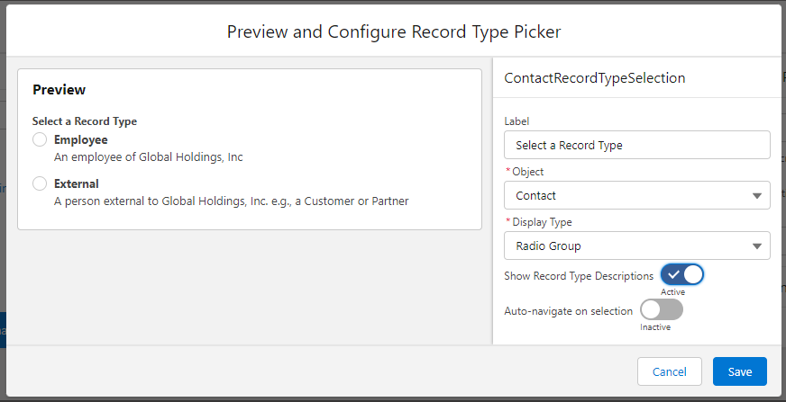

# User-aware RecordType Picker for Flows (beta)

Have you ever needed to build a Screen Flow that asks the user to select a record type for a record you want to create in the Flow? Using Out-of-the-Box tools, you can do things like hard-code a list of Choices, or use a RecordType collection and collection choice to present choices of Record Types to pick, but with these options it is not possible to _only_ present the Record Types that the running user has access to create!

This has bothered me for quite some time, so I decided to do something about it.

This project is an open-source free-to-use component that can be used in Screen Flows to give users selectable choices of Record Types for a given Object with Record Types that automatically only shows Record Types that are available to the running user.

Features included in this first beta release:
 - Custom Property Editor with a Preview mode
 - 3 display types (Visual Picker, Radio Group, Picklist)
 - Optional Show or Hide Description
 - Optional Auto-Next Navigation on Select
 - Invocable Action to get a Collection of RecordTypes available to the running user for use with other screen components like Collection Choices or Data Table

I've started building the issues log for enhancements and TODOs, feel free to submit issues and enhancement requests (PRs are welcome!)

NOTE ABOUT THE TEST DIRECTORY: the "test" directory is _not_ needed for sandbox or scratch org deploys. It includes RecordTypes on the Contact object that is useful for demonstrations and QA but you probably don't want them in an org you care about. Until we get packaging sorted and/or dependency injection with mocking for tests, I don't recommend deploying this to a production org unless you've written your own tests and are comfortable with how it works for you.

## Display Types 

### Visual Picker

### Radio Group

### Picklist

## Auto navigate on selection

Auto navigate on selection works best with the Visual Picker on a screen that doesn't have any other inputs and has the footer and/or Next button hidden. When the user clicks on a selection, the Flow will automatically navigate to the next screen. It is also recommended to provide a "Previous" button on the next screen so that the user has a chance change their selection if they've made a mistake.

## Invocable Action

Also included in this project is an invocable action. If you would rather use your own screen component and just need a way to get a collection of RecordTypes for an object that are available to the running user, you can use this invocable action to retrieve that collection, then use it where you need, such as a Data Table:

